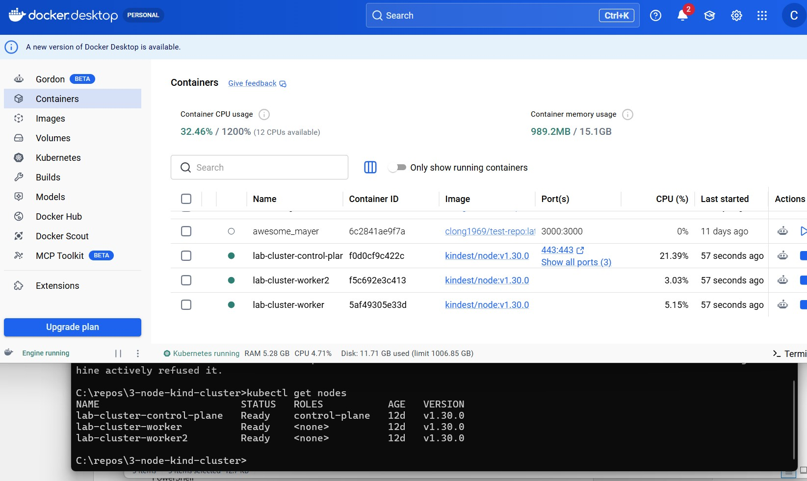

# 3 Node Kind cluster on single laptop



## Make sure you have:

### Docker Desktop installed and running
•	Enable Kubernetes NOT required (we’ll use Kind)
•	Allocate at least: 
-	4 CPUs
-	6–8 GB RAM
### kubectl installed
- Shell
- kubectl version --client
### kind (Kubernetes IN Docker) installed
- Install via:
## Mac (Homebrew):
Shell
brew install kind
## Windows (Chocolatey):
PowerShell
choco install kind
## Linux:
Shell
curl -Lo ./kind https://kind.sigs.k8s.io/dl/latest/kind-linux-amd64
chmod +x ./kind
sudo mv ./kind /usr/local/bin/kind

Verify:
Shell
kind version
________________________________________
## Step 1 — Define a 3-node Cluster Config
Kind creates clusters based on a YAML config. Create a file:
Shell
nano kind-3node.yaml
Paste this:
YAML
kind: Cluster
apiVersion: kind.x-k8s.io/v1alpha4
nodes:
### Control plane node
- role: control-plane

### Worker nodes
- role: worker
- role: worker
### This gives you:
-	1 control-plane node
-	2 worker nodes
Total: 3 nodes
________________________________________
## Step 2 — Create the Cluster
###Run:
Shell
kind create cluster --name dev-cluster --config kind-3node.yaml
###
-	Spin up 3 Docker containers (each acts as a node)
-	Configure networking
-	Set your kubeconfig automatically
### Takes about 30–60 seconds.
________________________________________
## Step 3 — Verify the Cluster
Check nodes:
Shell
kubectl get nodes

 
Expected output:
Plain Text
NAME STATUS ROLES AGE VERSION
dev-cluster-control-plane Ready control-plane X v1.xx
dev-cluster-worker Ready <none> X v1.xx
dev-cluster-worker2 Ready <none> X v1.xx

Check cluster info:
Shell
kubectl cluster-info

 


 


________________________________________
## Step 4 — Deploy a Test Application
Let’s confirm everything works across nodes.
Create a deployment:
Shell
docker pull nginx
kubectl create deployment nginx --image=nginx

 
 
Scale it:
Shell
kubectl scale deployment nginx --replicas=5
 
Check pod distribution:
Shell
kubectl get pods -o wide

 
You should see pods spread across your 2 worker nodes.
________________________________________
## Step 5 — Expose the Application
Shell
kubectl expose deployment nginx --type=NodePort --port=80
 
Check service:
Shell
kubectl get svc nginx
 
To access it:
Shell
kubectl port-forward svc/nginx 8080:80
Then open:
http://localhost:8080
 
________________________________________
## Step 6 — (Optional) Customize Node Behavior
If you want more control (like port mappings), use:
YAML
nodes:
  - role: control-plane
  extraPortMappings:
  - containerPort: 30000
 hostPort: 8080
 - role: worker
 - role: worker
________________________________________
## Step 7 — Tear Down the Cluster
If you are done, you can tear down your cluster. If you would like to add to your cluster, skip to step 8.
Shell
kind delete cluster --name dev-cluster
________________________________________
Pro Tips (from real-world use)
Resource Awareness
•	Each node = Docker container
•	3-node cluster can eat ~2–3 GB RAM
•	Increase Docker memory if pods get stuck in Pending
________________________________________
### Recreating Fast
Shell
kind delete cluster --name dev-cluster && \
kind create cluster --name dev-cluster --config kind-3node.yaml
________________________________________
### Useful Debug Commands
Shell
docker ps # See nodes as containers
 
docker stats # Watch resource usage
 
kubectl describe node # Debug scheduling issues
 
This is only a small portion of the information generated by this command.
________________________________________
Load Local Images into Kind
If you build Docker images locally:
Shell
kind load docker-image my-app:latest --name dev-cluster

________________________________________
# Summary
## You now have:
-	Local 3-node Kubernetes cluster
-	Fully functional scheduler & networking
-	Realistic multi-node environment for testing
________________________________________
## Next steps:
-	Adding Ingress (NGINX)
-	Simulating multi-AZ clusters
-	Running CI pipelines locally
-	Setting up persistent volumes in Kind

## Step 8 — Create Kind Cluster with Port Mapping (IMPORTANT)
Ingress needs access from your host → cluster.
Update your kind config (or recreate cluster with this):

````yaml
kind: Cluster
apiVersion: kind.x-k8s.io/v1alpha4
nodes:
  - role: control-plane
    extraPortMappings:
      - containerPort: 80     # HTTP
        hostPort: 80
        protocol: TCP
      - containerPort: 443    # HTTPS
        hostPort: 443
        protocol: TCP

  - role: worker
  - role: worker
````
Create the cluster:
Shell
kind create cluster --name dev-cluster --config kind-3node.yaml
This allows:
-	localhost:80 → ingress controller
-	localhost:443 → ingress controller
 
________________________________________
## Step 9 — Install NGINX Ingress Controller
Apply the official Kind-specific manifest:
Shell
kubectl apply -f https://raw.githubusercontent.com/kubernetes/ingress-nginx/main/deploy/static/provider/kind/deploy.yaml
This deploys:
-	ingress controller pod(s)
-	service
-	RBAC setup
 
________________________________________
## Step 10 — Wait for Ingress Controller to Be Ready
Shell
kubectl get pods -n ingress-nginx
Wait until you see:
ingress-nginx-controller-xxxxx   Running
 
If needed:
Shell
kubectl wait --namespace ingress-nginx \
--for=condition=ready pod \
--selector=app.kubernetes.io/component=controller \
--timeout=90s
________________________________________
## Step 11 — Deploy a Test App
Shell
````text
kubectl create deployment web --image=nginx
kubectl expose deployment web --port=80
```` 
Verify:
Shell
````text
kubectl get svc web
```` 
________________________________________
## Step 12 — Create an Ingress Resource
Create a file:
Shell

````text
nano ingress.yaml
````
Paste:

````yaml
apiVersion: networking.k8s.io/v1
kind: Ingress
metadata:
  name: web-ingress
spec:
  rules:
    - host: web.local
      http:
        paths:
          - path: /
            pathType: Prefix
            backend:
              service:
                name: web
                port:
                  number: 80
````                  
Apply it:
Shell
````text
kubectl apply -f ingress.yaml
'''' 
________________________________________
## Step 13 — Update Hosts File (Critical for Local Testing)
Since web.local isn’t real DNS, map it locally.
Windows:
Edit:
C:\Windows\System32\drivers\etc\hosts
Add:
127.0.0.1 web.local
Mac/Linux:
Shell
sudo nano /etc/hosts
Add:
127.0.0.1 web.local
________________________________________
## Step 14 — Test It
Open:
http://web.local
You should see the NGINX welcome page.
________________________________________
Debugging If It Doesn’t Work
Check ingress:
Shell
kubectl get ingress
 
Describe it:
Shell
kubectl describe ingress web-ingress
 
________________________________________
Check controller logs:
Shell
kubectl logs -n ingress-nginx deploy/ingress-nginx-controller
 
Actual output is larger.
________________________________________
### Verify port mapping:
Shell
docker ps
 
Make sure ports 80/443 are mapped.
________________________________________
### Common Issues
Issue	Cause	Fix
Cannot access site	No port mapping	Recreate cluster
Host not resolving	Missing hosts entry	Update hosts file
404 from nginx	Ingress rule mismatch	Check path/service
Pod ImagePullBackOff	Image not loaded	Load image into Kind
________________________________________
### Quick Summary (Interview Style)
•	Install NGINX Ingress via manifest
•	Configure Kind with port mappings
•	Deploy services
•	Create ingress rules
•	Map hostname to localhost
•	Verify routing via browser

